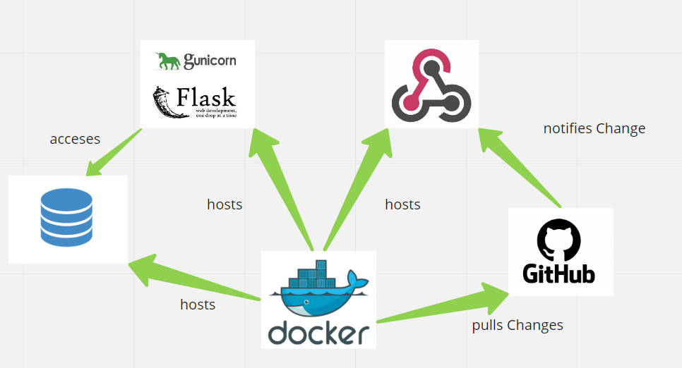

# Projekt-Knock-Knock


[Projekt Knock Knock](http://speicher-stadt.synology.me:9003)


## Introduction

Uber(- Eats), Lieferando, Taxis, Paketdienste, Lieferservices (z.B. Rewe), sowie viele weitere Dienste bestehen im Kern aus zwei Gruppen von Akteuren:  
- Privatpersonen/ Unternehmer, welche einen Fahrer benötigen  
- Privatpersonen/ Unternehmer, welche als Fahrer arbeiten möchten

Stand heute existieren viele verschiedene - nicht selten auch in Konkurrenz stehende, Plattformen, Websites, Apps, usw. für die einzelnen Dienste, auf welchen sich die beiden Gruppen koordinieren und miteinander in Kontakt treten können(z.B. Free Now). Unser Projekt verfolgt die Idee eine univeerselle Plattform zum Ustauch zwischen Fahrern und Auftraggebern zu kreieren. So können Ressourcen (z.B. aus Sicht der Auftraggeber die Fahrer) geteilt werden. Konkret wäre das eine Website, auf der man die Möglichkeit hat  
- sich ein Profil zu erstellen  
- Nachrichten auszutauschen  
- Gesuche/ Angebote zu schalten

Für beteiligte würde ein solches Angebot mit diversen Vorteilen einhergehen:  
- Mehr Flexibilität (zeitlich und örtlich) für Auftraggeber, da mehr Fahrer zur Verfügung stehen  
- Auswahlmöglichkeit für Fahrer (kaum Barrieren bei Auftraggeberwechsel)  
- Chance für Fahrer Leerlaufzeiten zu reduzieren  
- Auftraggeber können auf Bedarfsschwankungen besser reagieren  
- Auftragnehmer können Aufträge von unterschiedlichen Arbeitnehmern annehmen


## Table of Contents  

- [Structure](#Structure)
- [How to Run](#How-to-run)

## Structure




Die Infrastruktur der vorher erwähnten Webanwendung wollen wir dabei wie folgt aufbauen:  

### Backend:   
- das Backend wird mit der Sprache Python und dem Webframework Flask umgesetzt  

### Frontend:
- Service wird über eine (responisive) Website über den Browser der Nutzer dargestellt  
- Frontend wird mit HTML, CSS und JS entwickelt

### Server Infrastruktur  
- Für den Server verwenden wir unsere eigene Maschine welche die Flask Webapp über einen Gunicorn Server in einem Docker Container hostet  
- ein Webhook achtet auf Änderungen im GitHub Repo um die WebApp automatisch zu redeployen

### Codestruktur

- wir verwenden die WAM Softwarearchitektur, die Ordnerstruktur ist dabei wie folgt:  

|  
|__Fachwerte  
|  
|__Materialien  
|  
|__Werkzeuge  
|  
|__static  
|  
|__templates  

**Fachwerte**  
- basic values that are not mutable

**Materialien**  
- modules that use Fachwerte  

**Werkzeuge**  
- use Materialien and Fachwerte and display the results in a GUI  

**static**
- contains css and js files  

**templates**  
- contains html files  

## How to run  


Clone the Repository in a Directory of your choice  
`git clone https://github.com/LPaaS-WiInf-Projektgruppe/Projekt-Knock-Knock.git`  

navigate into the project_knock_knock directory  
`cd Projekt_knock_knock/project_knock_knock`  

Install dependencies  
`pip install -r requirements.txt`

Change example configuration for actual configuration    
`type example_config.py > config.py`  

 open config.py and set  

```
DB_NAME = 'project_knock_knock'  
SQLALCHEMY_DATABASE_URI = 'sqlite:///project_knock_knock.db'  
USER_ENABLE_REGISTER = True
USER_APP_NAME = "Project Knock Knock"  
```

Set enviroment variables  
`set FLASK_APP=wsgi.py`  
`set FLASK_ENV=development`  

Run Flask App  
`flask run --host localhost`  

In Browser navigate to localhost:5000 to see the WebApp
